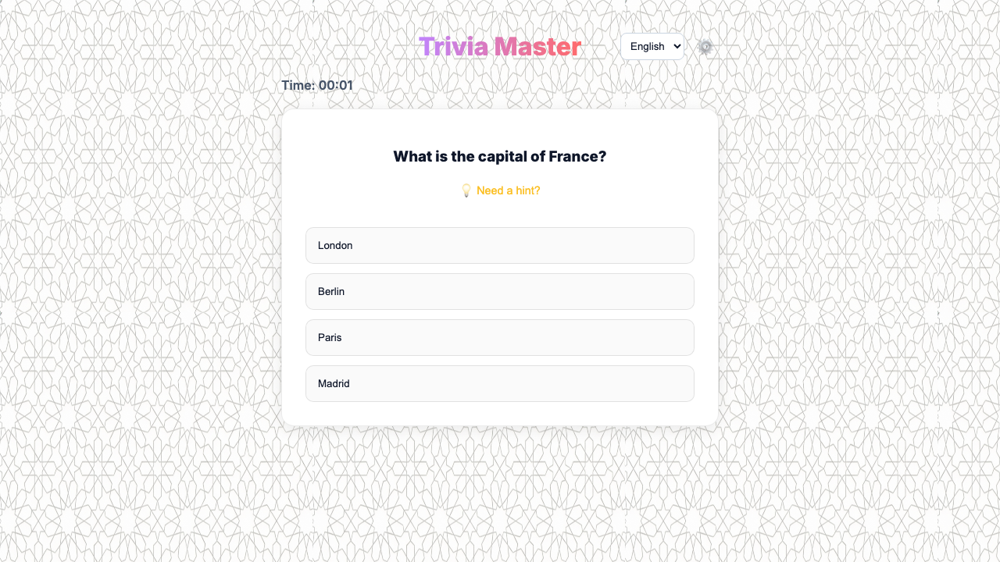
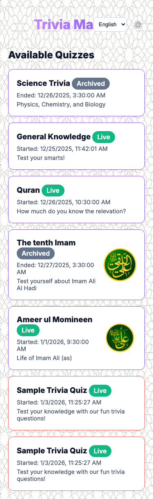

# Trivia Quiz Platform


A modern, real-time trivia quiz application built with Node.js, Express, and Vanilla JavaScript. Features a dark-mode responsive UI, live participant tracking, and a comprehensive admin dashboard.

## Screenshots

<table>
  <tr>
    <td></td>
    <td></td>
  </tr>
  <tr>
    <td></td>
    <td></td>
  </tr>
</table>

**Generate Screenshots**: Run `npm run test:screenshots` to capture fresh screenshots from the latest build.

## Features

### Public Interface
- **Real-time Lobby**: Live participant counts using WebSockets.
- **Deep Linking**: Shareable unique URLs for each quiz (e.g., `/?quizId=1`).
- **Multi-Language Support**: Users can switch between available languages (e.g., English, Spanish) in the lobby.
- **WhatsApp Integration**: Easy sharing of specific quizzes.
- **Rich Gameplay**:
    - Timed quizzes with server-side validation.
    - Question images and hint system.
    - Live leaderboards (Score + Time taken).
- **Responsive Design**: Mobile-friendly interface with sleek dark-mode aesthetics.

### Admin Dashboard
- **Secure Access**: Protected by an Admin Password.
- **Quiz Management**: Create, delete, and configure quizzes.
- **Visibility Control**: Toggle quiz visibility (Valid for testing hidden quizzes).
- **Theming**: Customize primary colors, background colors, and background images per quiz.
- **Question Editor**:
    - Add questions with optional images and hints.
    - **Translation Support**: specific input tabs to add translations for Question Text, Hints, and Options.

## Local Development

### Prerequisites
- Node.js (v18+)

### Setup
1. Clone the repository.
2. Install dependencies:
   ```bash
   npm install
   ```
3. Start the server:
   ```bash
   npm start
   ```
   *The server will start on port 3000.*

4. **Admin Login**:
   - Check the terminal output for the randomly generated **ADMIN PASSWORD** (e.g., `ADMIN PASSWORD: a1b2c3d4`).
   - Navigate to `http://localhost:3000`.
   - Click the gear icon (⚙️) and enter the password.

## Deployment (Docker)

This project includes a production-ready Docker setup with Nginx and Let's Encrypt SSL. You can also test locally with docker though, by building and running with

```
    docker compose build
    docker compose run --service-ports app
```

### Prerequisites
- Docker & Docker Compose installed on the server.
- A domain name pointing to your server's IP.

### Configuration
1. Open `nginx/conf.d/app.conf`:
   - Replace `example.com` with your actual domain name in both `server_name` directives and SSL paths.

2. Open `docker-compose.yml`:
   - (Optional) Set a fixed `ADMIN_PASSWORD` in the `app` service environment variables if you don't want a random one on every restart.
   ```yaml
   environment:
     - ADMIN_PASSWORD=my_secure_password
   ```

### Run
Build and start the services:
```bash
docker-compose up --build -d
```

- **App**: Runs on internal port 3000.
- **Nginx**: Exposes standard HTTP (80) and HTTPS (443).
- **Certbot**: Automatically requests and renews SSL certificates for your domain.

## Testing

This project uses Vitest for API/integration tests and Playwright for end-to-end tests.

### Run Tests
```bash
# Run all integration tests
npm test

# Run with coverage
npm run test:coverage

# Run in watch mode (development)
npm run test:watch

# Run E2E tests (Playwright)
npm run test:e2e
```

### Screenshots
To capture fresh screenshots for the README:
```bash
# Run screenshot tests (generates screenshots in /screenshots)
npm run test:screenshots

# Optional: Run organizer script
bash scripts/update-screenshots.sh

# Commit the new screenshots
git add screenshots/*.png
git commit -m "docs: update screenshots"
```

**Screenshots captured:**
- `homepage.png` - Main landing page
- `quiz-list.png` - Available quizzes
- `question.png` - Quiz question view
- `mobile.png` - Mobile responsive view

### Test Structure
- `tests/integration/` - API and integration tests (44 tests)
  - `api/public.test.js` - Public API endpoints (15 tests)
  - `api/admin.test.js` - Admin API endpoints (18 tests)
  - `api/websocket.test.js` - WebSocket functionality (11 tests)
- `tests/e2e/` - End-to-end browser tests (17 tests)
  - `smoke.spec.js` - Basic smoke tests (6 tests)
  - `user-flows/full-quiz-flow.spec.js` - Complete quiz participation flow (7 tests)
  - `user-flows/quiz-participation.spec.js` - Quiz UI interaction tests (4 tests)
- `tests/helpers/` - Test utilities and fixtures
  - `server.js` - Test server setup/teardown
  - `database.js` - Test database helpers
  - `fixtures.js` - Test data factories
  - `test-data.js` - E2E API helper class

## Project Structure
- `src/`
  - `app.js`: Application entry point.
  - `routes/`: Public and Admin API routes.
  - `middleware/`: Authentication and utilities.
  - `database.js`: SQLite connection and schema.
  - `websocket.js`: Real-time server logic.
- `public/`: Static frontend assets (HTML, CSS, JS).
- `nginx/`: Nginx configuration for reverse proxy.
